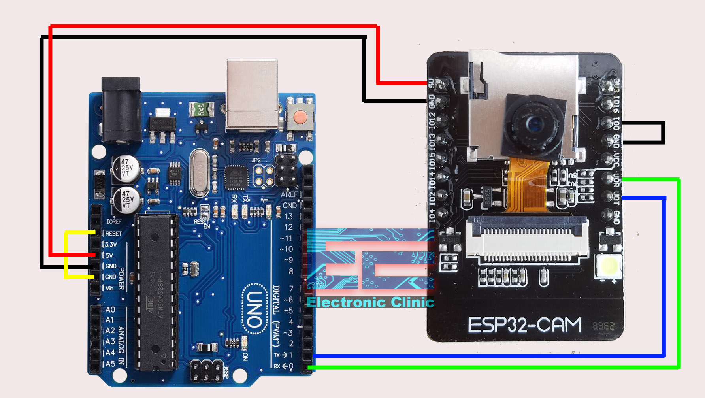

# StepWise
Your one step application to managing your store using hardware for real time data and assesing its performance via the following functionalities
* Hardware: Arduino UNO and ESP32-Cam for detection of people
* Measurement of footfall in the store aisle
* Measurement of purchase and profits
* Measurement of performance
* Measurement of potential per aisle
- - - -
### Setup of the Hardware
Make the following connections with the Arduino UNO and the ESP32-Cam with the jumper wires as shown below:


After doing the above please go Arduino site and download the Arduino IDE: [Arduino IDE Download](https://www.arduino.cc/en/software)

After the above step then use the code in the ESP32-Loader/ESP32-Loader.ino in our repository and use your Wifi Name and Password in the code.

After the above you need to upload the zip file for the "esp32cam.h" library to the Arduino IDE after opening it from the github link given: [Download ZIP](https://github.com/yoursunny/esp32cam)

Then you have to copy paste the following link into the Additional Boards Manager URLs in the ***(File>Preferences)***:
```
https://raw.githubusercontent.com/espressif/arduino-esp32/gh-pages/package_esp32_index.json, https://raw.githubusercontent.com/espressif/arduino-esp32/gh-pages/package_esp32_index.json, http://arduino.esp8266.com/stable/package_esp8266com_index.json
```
After the above go to ***(Tools>Board>Boards Manager)*** and search for 'esp32' and install it 
and after installation again go to ***(Tools>Board>ESP32 Arduino)*** and select ESP32 Wrover Module and make sure to set the configurations:
* Upload Speed: 115200
* Flash Frequency: 40MHz
* Flash Mode: QIO
* Partition Scheme: Huge APP (3MB no OTA/1MB SPIFFS)

Verify and upload the code and then after **"Hard resetting via RTS pin"** message comes in terminal of Arduino IDE open the Serial Monitor and make sure the baud rate is "115200" and press the reset button on the ESP32-Cam then remove the wires connecting GND and IO0 on the ESP32-Cam and press reset again and you will get a link if the connection to the network happens successfully.

***(Note: Make sure you have Python install going foward, if not download from the link: [Download Python](https://www.python.org/downloads/))***

From the url ***"http://(your url)/cam-hi.jpg"*** use the imgdet.py file and copy paste the url you got from the above code and install the following libraries for the code:
```
> pip install opencv-python
> pip install tensorflow
> pip install cvlib
> pip install matplotlib
> pip install pandas
> pip install numpy
```
We use the **"yolov4-tiny"** model, and detect people who are labelled as "person" in the detection window.

You can run the python file in the terminal to start the detection via:
```
> python imgdet.py
```
- - - -
### Setup of the Application

We use Streamlit framework for the building of the application and the libraries used for it can be downloaded via:
```
> pip install streamlit
> pip install pandas
```
and then we run the application using the app.py file via:
```
> streamlit run app.py
```
Now you can use the application easily and manage your store.
- - - -
### Requirements
All the requirements can be found the in the ***requirements.txt*** file in our repository
- - - -
### Technologies Used
* ESP32-Cam (Live Transmission)
* Arduino UNO (Microcontroller)
* C++ (Arduino Code)
* Python (Programming Language)
* Streamlit (Building the application)
* Tensorflow and OpenCV (Detection of People *(yolov4-tiny)*)
* Pandas and Numpy (Data Manipulation and Reading Libraries)
* Matplotlib (Output bounded people with boxes in detection transmission)
- - - -
### Authors
* [Abhijith Ajith](https://github.com/AAbhijithA)
* [Amoghavarsh SH](https://github.com/AsHtrich)
* [Aravind Krishnan](https://github.com/aravindk017)
